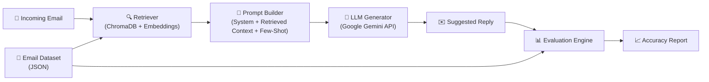
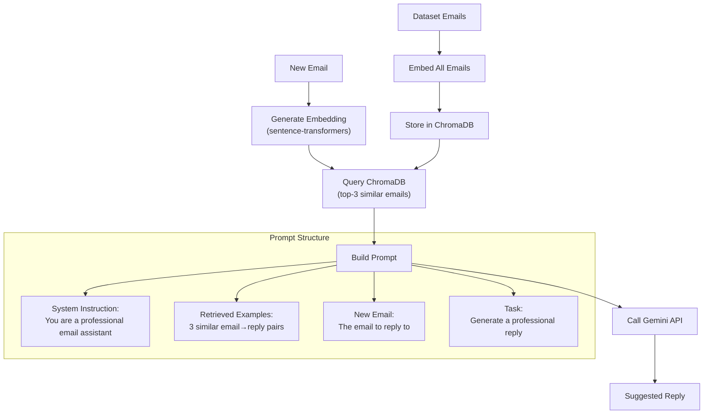

# AI Email Suggested-Response System — Implementation Plan

## Goal

Build an end-to-end system that: (1) maintains a dataset of email→reply pairs, (2) generates suggested replies to new emails using an LLM grounded via RAG, and (3) evaluates generated responses with a multi-dimensional accuracy framework. The system must be runnable, well-documented, and ship as a public GitHub repository.

---

## Architecture Overview



---

## Project Structure

```
ai-email-responder/
├── README.md                          # Full documentation
├── requirements.txt                   # Python dependencies
├── .env.example                       # API key template
├── setup.py                           # Optional package setup
│
├── data/
│   ├── generate_dataset.py            # Script to generate synthetic dataset
│   ├── email_dataset.json             # The generated dataset (100 email-reply pairs)
│   └── dataset_schema.md             # Schema documentation
│
├── src/
│   ├── __init__.py
│   ├── config.py                      # Configuration & env loading
│   ├── embeddings.py                  # Embedding model wrapper
│   ├── vector_store.py                # ChromaDB vector store management
│   ├── retriever.py                   # Retrieval logic (find similar past emails)
│   ├── generator.py                   # LLM-based response generator
│   └── pipeline.py                    # End-to-end pipeline orchestrator
│
├── evaluation/
│   ├── __init__.py
│   ├── metrics.py                     # All metric implementations
│   ├── llm_judge.py                   # LLM-as-a-Judge evaluator
│   ├── evaluator.py                   # Orchestrates all metrics
│   └── report.py                      # Report generation (per-response + overall)
│
├── tests/
│   ├── test_dataset.py                # Dataset validation tests
│   ├── test_pipeline.py               # Pipeline integration tests
│   └── test_evaluation.py             # Evaluation system tests
│
└── scripts/
    ├── run_pipeline.py                # CLI: generate reply for a single email
    ├── run_evaluation.py              # CLI: evaluate system on test set
    └── run_demo.py                    # CLI: full end-to-end demo
```

---

## Component 1: Dataset

### Strategy: Hand-Authored Synthetic Dataset

We will create a **synthetic dataset of 100 email-reply pairs** using a structured generation script. This approach is chosen over public corpora (like Enron) because:

| Approach | Pros | Cons |
|----------|------|------|
| **Enron corpus** | Real data, large scale | Requires heavy cleaning; privacy concerns; many emails lack clear reply pairs; domain-specific to energy trading |
| **Synthetic (chosen)** | Full control over quality, diversity, and coverage; no privacy issues; can design for evaluation | Not "real" data; requires justification |
| **LLM-generated** | Fast to create, diverse | Circular reasoning if same LLM generates and evaluates |

**Our approach**: Hand-author **20 template scenarios** across 5 business email categories, then use an LLM to expand each into 5 realistic variations — yielding **100 diverse pairs**. We then manually review and curate to ensure quality.

### Email Categories (20 scenarios across 5 categories)

| Category | # Scenarios | Examples |
|----------|-------------|---------|
| **Meeting Scheduling** | 4 | Request to schedule, reschedule, cancel, confirm |
| **Project Updates** | 4 | Status request, deadline extension, blocker report, milestone completion |
| **Customer Support** | 4 | Complaint, refund request, product inquiry, billing issue |
| **HR/Internal** | 4 | PTO request, onboarding question, policy clarification, feedback |
| **Sales/Partnership** | 4 | Cold outreach response, proposal follow-up, pricing negotiation, contract question |

### Dataset Schema

```json
{
  "id": "email_042",
  "category": "customer_support",
  "scenario": "refund_request",
  "incoming_email": {
    "from": "jane.doe@customer.com",
    "to": "support@company.com",
    "subject": "Request for Refund - Order #12345",
    "body": "Hi, I received my order yesterday but the product was damaged..."
  },
  "expected_reply": {
    "subject": "Re: Request for Refund - Order #12345",
    "body": "Dear Jane, Thank you for reaching out. I'm sorry to hear about the damage..."
  },
  "metadata": {
    "tone": "empathetic_professional",
    "intent": "acknowledge_and_resolve",
    "key_actions": ["apologize", "offer_refund_or_replacement", "provide_timeline"],
    "complexity": "medium"
  }
}
```

The `metadata` field is crucial — it gives our evaluation system ground-truth signals about what a good reply *should* contain, beyond just text matching.

### Dataset Generation Script

[generate_dataset.py](file:///c:/Users/manan/OneDrive/Desktop/New%20folder/data/generate_dataset.py) will:
1. Define 20 scenario templates with structured fields
2. Use Google Gemini API to expand each into 5 realistic variations
3. Add metadata annotations (tone, intent, key_actions)
4. Output `email_dataset.json` with train (80) / test (20) split markers
5. Include a `--validate` flag to run schema checks

---

## Component 2: Response Generator (RAG Pipeline)

### Architecture: Retrieval-Augmented Generation with Few-Shot Examples



### Why RAG + Few-Shot (Not Fine-Tuning)

| Approach | Chosen? | Reasoning |
|----------|---------|-----------|
| **Zero-shot prompting** | ❌ | No grounding in historical data; generic outputs |
| **Fine-tuning** | ❌ | Requires 1000s of examples; expensive; overfits to small dataset |
| **RAG + Few-Shot** | ✅ | Grounds generation in real examples; adapts to new patterns without retraining; interpretable (we can show which examples were retrieved) |
| **Full RAG pipeline** | ✅ | ChromaDB is lightweight, local, and free — no external vector DB needed |

### Implementation Details

#### [config.py](file:///c:/Users/manan/OneDrive/Desktop/New%20folder/src/config.py)
- Load API keys from `.env` (supports `GOOGLE_API_KEY` for Gemini)
- Configuration dataclass with model names, temperature, top-k retrieval count
- Supports both Gemini and OpenAI backends (Gemini as default)

#### [embeddings.py](file:///c:/Users/manan/OneDrive/Desktop/New%20folder/src/embeddings.py)
- Wrap `sentence-transformers` (`all-MiniLM-L6-v2`) for local embedding generation
- Provides `embed_text(text) -> List[float]` and `embed_batch(texts) -> List[List[float]]`
- Chosen model: fast, free, good quality for semantic similarity

#### [vector_store.py](file:///c:/Users/manan/OneDrive/Desktop/New%20folder/src/vector_store.py)
- Initialize ChromaDB persistent collection
- `index_dataset(dataset)` — embed and store all email bodies
- `query(text, k=3) -> List[EmailPair]` — retrieve top-k similar past emails
- Store both email body and reply in metadata for retrieval

#### [retriever.py](file:///c:/Users/manan/OneDrive/Desktop/New%20folder/src/retriever.py)
- Combines embedding + vector store query
- Returns structured `RetrievedContext` objects with similarity scores
- Filters out exact matches (to avoid data leakage during evaluation)

#### [generator.py](file:///c:/Users/manan/OneDrive/Desktop/New%20folder/src/generator.py)
- Builds the augmented prompt with system instruction + retrieved examples + new email
- Calls Google Gemini API (`gemini-2.0-flash` as default — fast, capable, cost-effective)
- Returns `GeneratedReply` with the text and metadata (retrieved examples used, model, latency)

#### Prompt Template

```
You are a professional email assistant. Based on similar past emails and their
replies, generate an appropriate response to the new incoming email.

## Past Email Examples (for reference):
{retrieved_examples}

## New Incoming Email:
From: {from}
Subject: {subject}
Body: {body}

## Instructions:
- Match the professional tone of the past examples
- Address all points raised in the email
- Be concise but thorough
- Include appropriate greeting and sign-off

Generate the reply:
```

#### [pipeline.py](file:///c:/Users/manan/OneDrive/Desktop/New%20folder/src/pipeline.py)
- Orchestrates: load dataset → index → retrieve → generate
- `Pipeline.respond(email_text) -> GeneratedReply`
- Handles initialization, caching, and error states
- Exposes `Pipeline.evaluate(test_set) -> EvaluationReport`

---

## Component 3: Accuracy/Evaluation System (Core Focus)

> [!IMPORTANT]
> This is the most heavily weighted component. The evaluation system uses a **multi-dimensional framework** that combines automated metrics with LLM-as-a-Judge scoring to produce interpretable, validated accuracy measurements.

### What "Accurate" Means for Email Replies

Exact match is meaningless — there are many valid replies to any email. We define accuracy across **5 dimensions**:

| Dimension | What It Measures | Why It Matters |
|-----------|-----------------|----------------|
| **Semantic Similarity** | Does the generated reply convey the same *meaning* as the reference? | Captures paraphrasing; core "correctness" signal |
| **Intent Alignment** | Does the reply address the same *goals* (e.g., apologize, offer refund)? | An email can be semantically different but functionally correct |
| **Tone Appropriateness** | Is the tone professional, empathetic, or firm as required? | Wrong tone = wrong reply, even if content is right |
| **Completeness** | Does the reply address *all* points raised in the incoming email? | Missing a key action = incomplete reply |
| **Coherence & Fluency** | Is the reply well-structured, grammatically correct, readable? | Baseline quality gate |

### Metric Implementation

#### Layer 1: Automated Metrics (Fast, Deterministic)

| Metric | Implementation | Score Range | What It Catches |
|--------|---------------|-------------|-----------------|
| **ROUGE-L** | `rouge-score` library | 0.0–1.0 | Structural/lexical overlap — sanity check |
| **BERTScore** | `bert-score` library | 0.0–1.0 | Semantic similarity at token level |
| **Sentence Similarity** | `sentence-transformers` cosine similarity | 0.0–1.0 | Overall meaning alignment |
| **Key Action Coverage** | Custom: check if expected actions appear in reply | 0.0–1.0 | Completeness (uses metadata `key_actions`) |

#### Layer 2: LLM-as-a-Judge (Nuanced, Interpretable)

Uses Google Gemini as a judge to score each response on the 5 dimensions above. This is the **primary quality signal**.

```python
# LLM Judge Prompt (simplified)
"""
You are an expert email quality evaluator. Given:
1. The incoming email
2. The reference (human-written) reply
3. The AI-generated reply

Score the AI reply on these dimensions (1-5 scale):

1. SEMANTIC_ACCURACY: Does it convey the same core message?
2. INTENT_ALIGNMENT: Does it address the same goals/actions?
3. TONE: Is the tone appropriate for this context?
4. COMPLETENESS: Does it address all points in the incoming email?
5. COHERENCE: Is it well-written and professional?

For each dimension, provide:
- Score (1-5)
- Brief justification (1-2 sentences)

Output as JSON.
"""
```

#### Layer 3: Composite Score

```python
composite_score = (
    0.10 * rouge_l +           # Lexical sanity check
    0.20 * bert_score +         # Token-level semantic match
    0.15 * sentence_similarity + # Overall meaning
    0.15 * key_action_coverage + # Completeness
    0.40 * llm_judge_avg        # LLM judge (normalized to 0-1)
)
```

> [!NOTE]
> The LLM-as-a-Judge gets the highest weight (40%) because it's the only metric that can assess tone, intent, and nuanced quality. The automated metrics serve as fast, deterministic anchors that prevent the LLM judge from dominating unchecked.

### Validation: Proving the Metrics Reflect Real Quality

We validate our metrics aren't just numbers by running **controlled degradation tests**:

1. **Perfect baseline**: Score the reference reply against itself → should score ~1.0
2. **Paraphrase test**: Manually paraphrase 10 reference replies → should score high (>0.7) on semantic metrics even with different words
3. **Wrong-intent test**: Reply to a refund request with a meeting scheduling email → should score low on intent alignment
4. **Tone mismatch**: Reply to a complaint with a casual/joking tone → should score low on tone
5. **Incomplete test**: Reply that only addresses 1 of 3 points → should score low on completeness

These tests are implemented in [test_evaluation.py](file:///c:/Users/manan/OneDrive/Desktop/New%20folder/tests/test_evaluation.py) and serve as a **meta-evaluation** — evaluating the evaluator.

### Reporting

#### Per-Response Report

```json
{
  "email_id": "email_042",
  "category": "customer_support",
  "generated_reply": "Dear Jane, I sincerely apologize for...",
  "scores": {
    "rouge_l": 0.42,
    "bert_score": 0.87,
    "sentence_similarity": 0.83,
    "key_action_coverage": 1.0,
    "llm_judge": {
      "semantic_accuracy": {"score": 4, "reason": "Captures core message..."},
      "intent_alignment": {"score": 5, "reason": "Addresses refund..."},
      "tone": {"score": 4, "reason": "Professional and empathetic..."},
      "completeness": {"score": 5, "reason": "All points addressed..."},
      "coherence": {"score": 5, "reason": "Well-structured..."}
    },
    "composite_score": 0.84
  },
  "retrieved_examples": ["email_015", "email_027", "email_063"]
}
```

#### Overall System Report

```
╔══════════════════════════════════════════════════════╗
║          AI Email Responder — Evaluation Report      ║
╠══════════════════════════════════════════════════════╣
║ Test Set Size:        20 emails                      ║
║ Overall Composite:    0.78 / 1.00                    ║
║                                                      ║
║ ── Automated Metrics (Avg) ──────────────────────── ║
║ ROUGE-L:              0.35                           ║
║ BERTScore:            0.82                           ║
║ Sentence Similarity:  0.79                           ║
║ Key Action Coverage:  0.90                           ║
║                                                      ║
║ ── LLM Judge (Avg, 1-5 scale) ──────────────────── ║
║ Semantic Accuracy:    3.8                            ║
║ Intent Alignment:     4.2                            ║
║ Tone:                 4.5                            ║
║ Completeness:         4.0                            ║
║ Coherence:            4.6                            ║
║                                                      ║
║ ── By Category ──────────────────────────────────── ║
║ Meeting Scheduling:   0.82                           ║
║ Project Updates:      0.76                           ║
║ Customer Support:     0.80                           ║
║ HR/Internal:          0.74                           ║
║ Sales/Partnership:    0.78                           ║
╚══════════════════════════════════════════════════════╝
```

The report is output as both:
- **JSON** (machine-readable, for CI/CD integration)
- **Console table** (human-readable, for quick review)
- **Markdown** (for README / documentation)

---

## Component 4: README

The [README.md](file:///c:/Users/manan/OneDrive/Desktop/New%20folder/README.md) will cover:

1. **Project overview** and architecture diagram
2. **Quick Start** — 3-command setup (`pip install`, set API key, `python run_demo.py`)
3. **Dataset** — where it came from, why synthetic, category breakdown, schema
4. **Response Generator** — RAG architecture, why few-shot + retrieval, prompt design
5. **Evaluation System** — the 5 dimensions, why each metric, composite scoring, validation
6. **Results** — sample outputs, overall scores, analysis
7. **Trade-offs & Limitations** — honest assessment of what works and what doesn't
8. **AI Tool Usage** — how AI tools were used in building the system
9. **How to Run** — detailed CLI instructions for each component

---

## Dependencies

```
# Core
google-genai>=1.0.0          # Google Gemini API (unified SDK)
chromadb>=0.4.0               # Vector database
sentence-transformers>=2.2.0  # Embeddings

# Evaluation
rouge-score>=0.1.2            # ROUGE metric
bert-score>=0.3.13            # BERTScore metric
numpy>=1.24.0                 # Numerical operations

# Utilities
python-dotenv>=1.0.0          # Environment variable loading
rich>=13.0.0                  # Beautiful console output
```

> [!IMPORTANT]
> The system uses **Google Gemini API** (`gemini-2.0-flash`) for both generation and LLM-as-a-Judge evaluation. Users need a `GOOGLE_API_KEY` which is free to obtain from [Google AI Studio](https://aistudio.google.com/).

---

## Execution Order

### Phase 1: Foundation (Files 1–4)
1. `requirements.txt` — dependencies
2. `.env.example` — API key template
3. `src/config.py` — configuration
4. `data/generate_dataset.py` + `data/email_dataset.json` — dataset

### Phase 2: RAG Pipeline (Files 5–9)
5. `src/embeddings.py` — embedding wrapper
6. `src/vector_store.py` — ChromaDB management
7. `src/retriever.py` — retrieval logic
8. `src/generator.py` — LLM generation
9. `src/pipeline.py` — end-to-end pipeline

### Phase 3: Evaluation (Files 10–13)
10. `evaluation/metrics.py` — automated metrics
11. `evaluation/llm_judge.py` — LLM-as-a-Judge
12. `evaluation/evaluator.py` — metric orchestration
13. `evaluation/report.py` — report generation

### Phase 4: CLI & Documentation (Files 14–17)
14. `scripts/run_pipeline.py` — single email CLI
15. `scripts/run_evaluation.py` — evaluation CLI
16. `scripts/run_demo.py` — full demo
17. `README.md` — documentation

### Phase 5: Verification
18. Run `python scripts/run_demo.py` end-to-end
19. Verify evaluation scores are sensible
20. Run degradation validation tests
21. Final README review

---

## Open Questions

> [!IMPORTANT]
> **LLM Provider**: The plan defaults to **Google Gemini API** (free tier available via AI Studio). If you prefer **OpenAI**, **Anthropic**, or a **local model via Ollama**, I can adjust the implementation. Which do you prefer?

> [!IMPORTANT]
> **Dataset Size**: The plan targets **100 email-reply pairs** (80 train / 20 test). This is enough to demonstrate the system while keeping generation costs low. Would you like more?

> [!NOTE]
> **Evaluation Cost**: The LLM-as-a-Judge evaluation requires one Gemini API call per test email (20 calls for the test set). This is negligible on the free tier but worth noting.

---

## Verification Plan

### Automated Tests
```bash
# Validate dataset schema and content
python -m pytest tests/test_dataset.py -v

# Test pipeline generates valid responses
python -m pytest tests/test_pipeline.py -v

# Test evaluation metrics produce expected scores on controlled inputs
python -m pytest tests/test_evaluation.py -v
```

### Manual Verification
- Run `python scripts/run_demo.py` and review the full output
- Inspect 5 generated replies for quality
- Verify evaluation report has per-response and overall scores
- Run degradation tests to confirm metrics respond correctly to bad inputs

### End-to-End Smoke Test
```bash
# Full demo: generate dataset → index → generate replies → evaluate → report
python scripts/run_demo.py
```
